# Nitido ユーザーマニュアル（Windows 版）

スキャンしたモノクロ楽譜 PNG の音符・五線を濃く・くっきりさせるデスクトップアプリ「Nitido」の使い方を、Windows 環境を例に解説します。

> macOS でもインストール時の Gatekeeper 警告（後述）以外は操作は共通です。

---

## 目次

1. [インストール](#1-インストール)
2. [起動と初期画面](#2-起動と初期画面)
3. [フォルダの選択](#3-フォルダの選択)
4. [プレビュー操作](#4-プレビュー操作)
5. [パラメータの調整](#5-パラメータの調整)
6. [表示モードの切り替え](#6-表示モードの切り替え)
7. [一括処理の実行](#7-一括処理の実行)
8. [CSV エクスポート](#8-csv-エクスポート)
9. [キーボードショートカット](#9-キーボードショートカット)
10. [設定の保存場所](#10-設定の保存場所)
11. [このアプリについて](#11-このアプリについて)

---

## 1. インストール

### 1.1 ダウンロード

[GitHub Releases](https://github.com/osprey74/score_denoiser/releases/latest) から、Windows 版インストーラをダウンロードします。

- 推奨: `Nitido_1.0.0_x64-setup.exe`（NSIS インストーラ）
- 代替: `Nitido_1.0.0_x64_en-US.msi`（MSI インストーラ）

### 1.2 SmartScreen 警告の対処（重要）

Nitido は **コード署名証明書を取得していないため**、初回実行時に Microsoft Defender SmartScreen が警告ダイアログを表示します。

#### ① 「Windows によって PC が保護されました」画面が出る

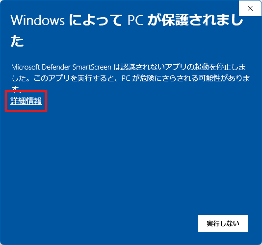

→ ダイアログ中央左の **「詳細情報」** をクリックしてください。

#### ② 「実行」ボタンが現れる

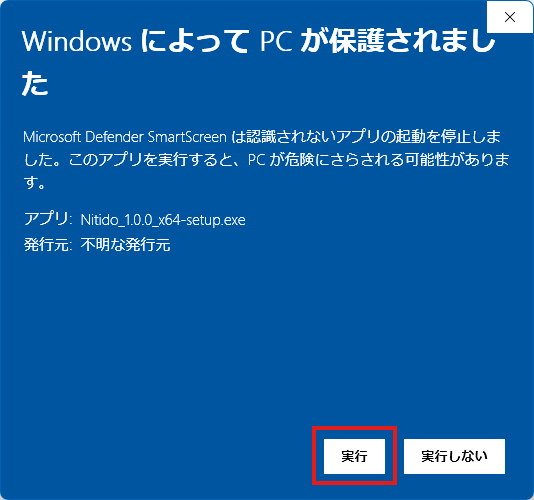

→ 右下の **「実行」** ボタンをクリックするとインストーラが起動します。

> **なぜ警告が出るのか**: Windows は、Microsoft の証明書ストアに登録されていない発行者のバイナリに対して保護的に警告を表示します。Nitido のソースコードと CI ビルドは [GitHub リポジトリ](https://github.com/osprey74/score_denoiser) で公開しており、内容を確認した上でご利用ください。

### 1.3 インストール手順

1. インストーラを起動するとセットアップウィザードが表示されます
2. インストール先フォルダ（デフォルト: `C:\Program Files\Nitido\`）を確認して **「次へ」**
3. **「インストール」** をクリック
4. 完了画面が出たら **「完了」** で閉じる
5. スタートメニューに **Nitido** が登録されます

---

## 2. 起動と初期画面

スタートメニューまたはデスクトップショートカットから **Nitido** を起動します。初回起動時はサイドカープロセス（画像処理用 Python サーバ）の起動を待つため、数秒「サイドカー起動中…」と表示されます。

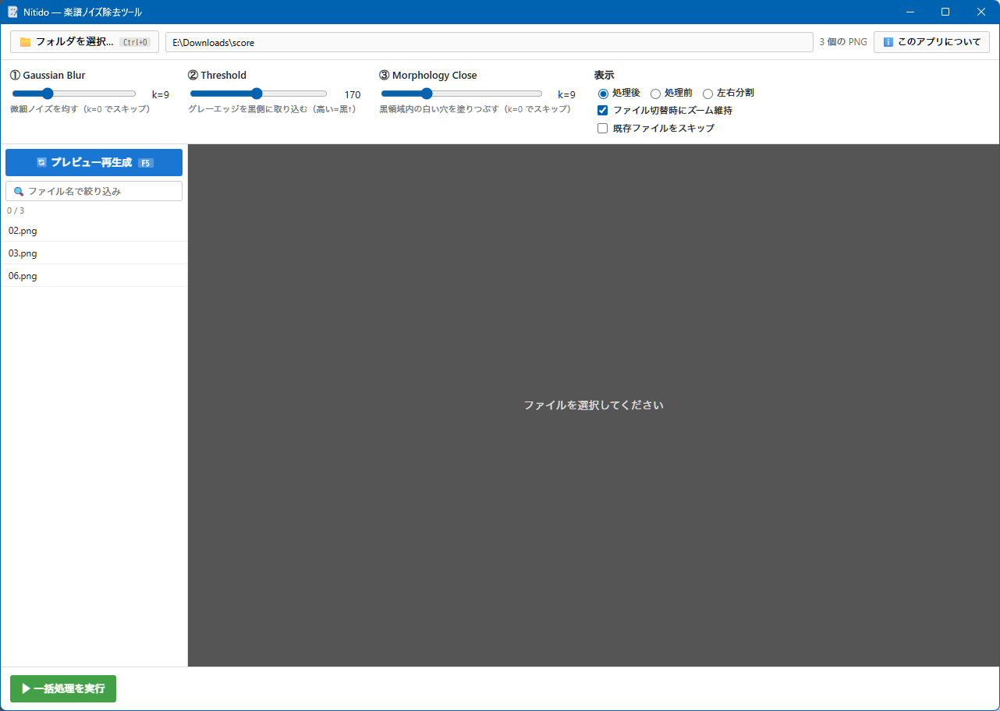

画面構成（上から下）:

| エリア | 役割 |
|---|---|
| **フォルダバー**（最上段） | フォルダ選択、ファイル数表示、「このアプリについて」 |
| **パラメータバー** | Blur / Threshold / Close / 表示モード設定 |
| **左ペイン: ファイルリスト** | フォルダ内 PNG 一覧、プレビュー再生成ボタン、検索ボックス |
| **右ペイン: プレビュー** | 処理結果のキャンバス（ズーム・パン可能） |
| **一括処理バー**（最下段） | 一括処理実行、進捗、CSV エクスポート |

---

## 3. フォルダの選択

楽譜 PNG が入っているフォルダを選びます。

### 方法 ① ボタンクリック

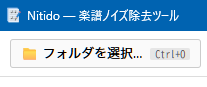

最上段の **「📁 フォルダを選択…」** ボタンをクリック → OS のフォルダ選択ダイアログで対象フォルダを指定します。

### 方法 ② キーボードショートカット

`Ctrl+O` を押すと同じダイアログが開きます。

### 選択後の表示

フォルダ内の PNG ファイルが左ペインのファイルリストに表示され、最初のファイルが自動的に選択されてプレビューが生成されます。

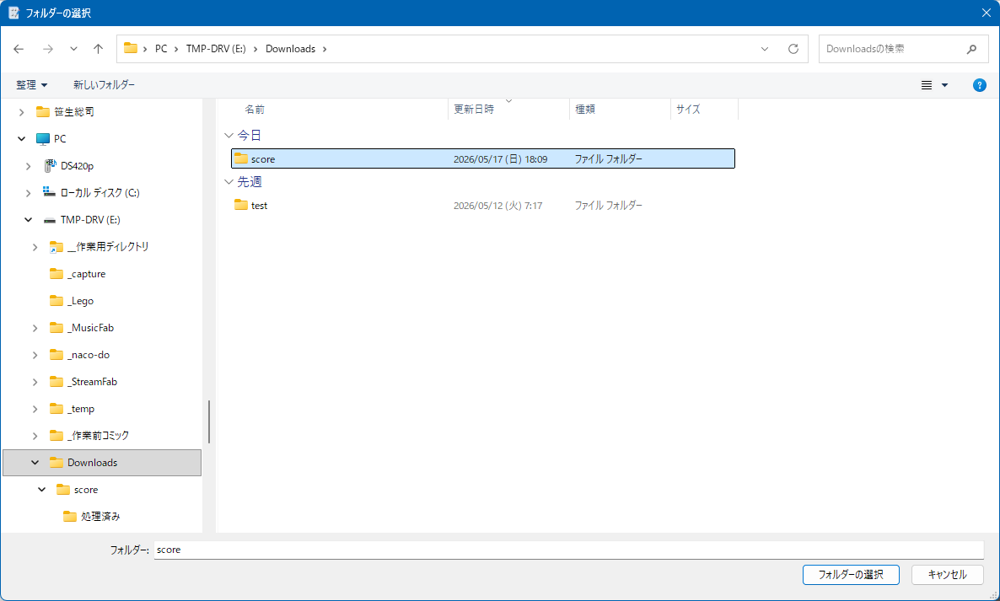

> 検出対象は **`.png`** ファイルのみです（`.jpg` 等は対象外）。

---

## 4. プレビュー操作

右ペインのキャンバスでは、生成された処理結果を **拡大／移動** して詳細を確認できます。

### 4.1 ズーム（拡大・縮小）

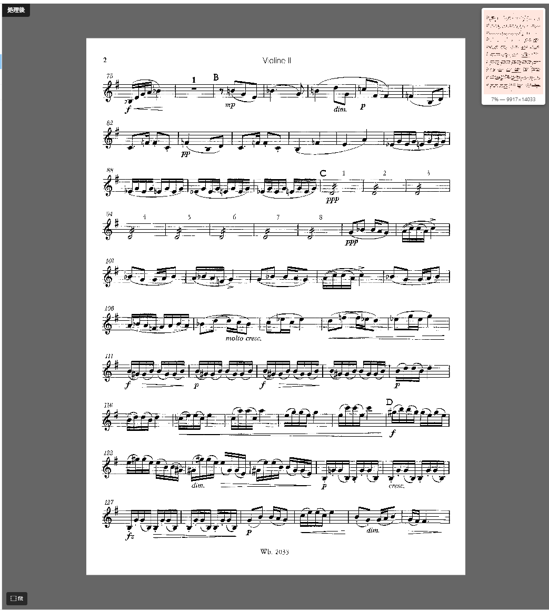

- **マウスホイール**: カーソル位置を中心にズーム
  - 上方向回転: 拡大
  - 下方向回転: 縮小
- ズーム倍率の範囲: 5% 〜 1600%
- 現在のズーム率は右上のミニマップ下に表示されます（例: `100% — 5653×8000`）

### 4.2 パン（表示位置の移動）

- キャンバス上で **左ボタンドラッグ** すると表示位置が移動します
- 画像範囲外には移動できません（自動的にクランプされます）

### 4.3 ミニマップ

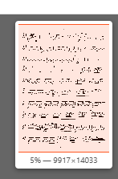

キャンバス右上に表示される **ミニマップ** は全体の縮小版です。

- オレンジ色の枠が現在の表示エリア
- ミニマップ上で **クリック** すると、その位置にビューポートがジャンプします

### 4.4 fit ボタン


キャンバス左下の **「⬚ fit」** ボタンで、画像全体が収まる倍率にリセットされます。`Home` キーでも同じ動作です。

### 4.5 ズーム維持の挙動

パラメータを変更しても **現在のズーム位置は保持されます**。これは細部を見比べながら閾値を調整するための仕様です。

ファイル切り替え時の挙動は、パラメータバーの **「ファイル切替時にズーム維持」** チェックボックスで制御できます:

- ✅ ON（デフォルト）: 別ファイルに切り替えても同じズーム位置を保つ
- ❌ OFF: ファイルを切り替えるたびに fit に戻る

---

## 5. パラメータの調整

画面上部のパラメータバーで、画像処理のパイプライン（3 段階）を制御します。

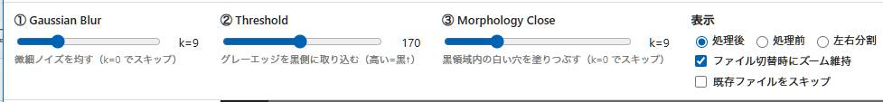

### 5.1 ① Gaussian Blur（ガウシアンブラー）

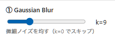

スキャン由来の **微細ノイズを平滑化** します。スライダー値はカーネルサイズ（奇数）。

| 値 | 効果 |
|---|---|
| なし (k=0) | ブラー処理をスキップ |
| k=3 | 軽度のノイズ抑制 |
| k=5 | **推奨**: 一般的なスキャン画像に最適 |
| k=7〜11 | 強めの平滑化（細い線が薄まる可能性） |
| k=15〜31 | 非常に強い平滑化（音符の輪郭が丸まる） |

### 5.2 ② Threshold（閾値）

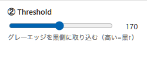

グレースケール画像を **白黒 2 値化** する境界値。値より暗いピクセルが黒、明るいピクセルが白になります（範囲 100〜245）。

| 値 | 効果 |
|---|---|
| 100〜180 | 黒の取り込みが控えめ（薄い文字が消える可能性） |
| **200〜230 (推奨)** | スキャンのグレーエッジまで黒に取り込む |
| 240〜245 | ほぼ全グレーを黒化（背景の汚れも残りやすい） |

### 5.3 ③ Morphology Close（モルフォロジー・クローズ）

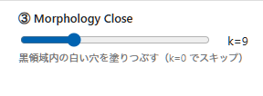

二値化後の **黒領域内に残った白い穴を埋める** 処理（楕円カーネル）。

| 値 | 効果 |
|---|---|
| なし (k=0) | Close 処理をスキップ |
| k=3 | 小さな穴（〜3px 径）を埋める |
| k=5 | **推奨**: 通常スキャンでは十分 |
| k=7〜11 | 中規模の穴埋め |
| k=15〜31 | 大きな穴埋め（線が太くなりすぎる場合あり） |

### 5.4 推奨パラメータ

最初は `Blur=5, Threshold=220, Close=5` から始めて、プレビューを見ながら微調整してください。

---

## 6. 表示モードの切り替え

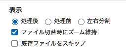

パラメータバーの「表示」セクションで、プレビューの内容を切り替えられます。

| モード | 表示内容 |
|---|---|
| **処理後**（デフォルト） | 処理結果のみを表示。最も高速 |
| **処理前** | 元画像のみを表示 |
| **左右分割** | 左に処理前、右に処理後を同時表示。**ズームとパンは連動** |

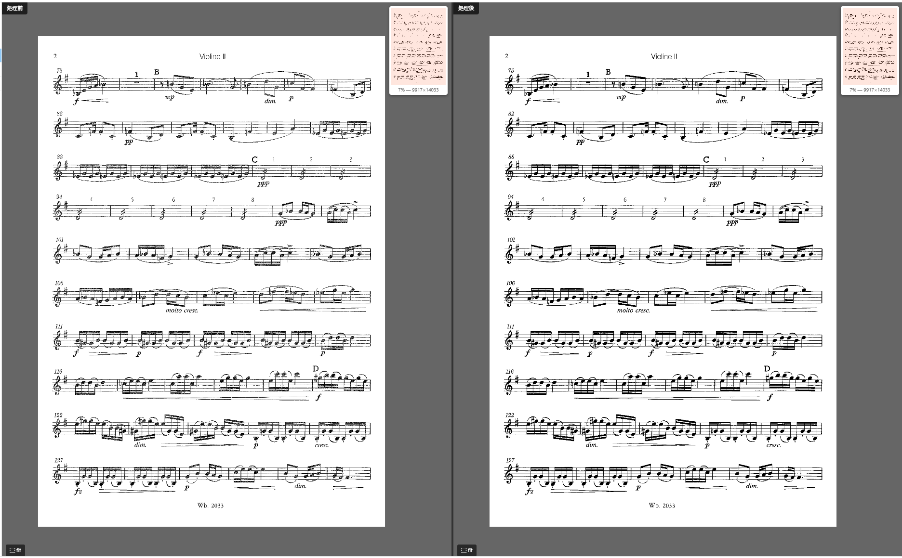

> 左右分割では、片方の canvas を操作するともう片方も同じビューポートで連動します。

---

## 7. 一括処理の実行

フォルダ内のすべての PNG を、現在のパラメータで一括処理します。

### 7.1 実行ボタン

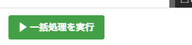

最下段の **「▶ 一括処理を実行」** ボタンをクリック → 確認ダイアログが表示され、続行すると処理が開始します。

### 7.2 出力先

処理結果は、選択フォルダ内の **「処理済み」** サブフォルダに、元のファイル名のまま保存されます。

```
C:\Users\<ユーザー>\Documents\スキャン楽譜\
├── 01.png              ← 元ファイル（変更されません）
├── 02.png
├── 03.png
└── 処理済み\            ← 自動作成
    ├── 01.png          ← 処理後
    ├── 02.png
    └── 03.png
```

### 7.3 進捗とキャンセル

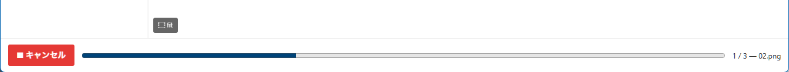

処理中は **進捗バー** とファイル名が表示されます。**「■ キャンセル」** ボタンで途中中断も可能です。

### 7.4 既存ファイルのスキップ

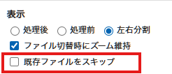

パラメータバーの **「既存ファイルをスキップ」** をチェックすると、`処理済み/` 内に既に存在するファイルは処理をスキップします（再実行の高速化に便利）。

---

## 8. CSV エクスポート

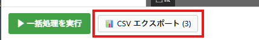

一括処理完了後、最下段右端に **「📊 CSV エクスポート」** ボタンが表示されます。クリックすると以下の CSV ファイルがダウンロードフォルダに保存されます:

| ファイル名 | `batch-result-<timestamp>.csv` |
|---|---|
| エンコーディング | UTF-8（BOM 付き、Excel 文字化けなし） |
| 列 | `filename, status, error` |
| status の値 | `done`（成功）/ `error`（失敗）/ `skipped`（スキップ） |

---

## 9. キーボードショートカット

| キー | 動作 |
|---|---|
| `Ctrl+O` | フォルダを選択 |
| `↑` または `←` | 前のファイル |
| `↓` または `→` | 次のファイル |
| `F5` | プレビュー再生成 |
| `Home` | ビューを画像全体に fit |

> 文字入力欄（検索ボックス等）にフォーカスがある時はショートカットが効きません。

---

## 10. 設定の保存場所

パラメータ・選択フォルダ・「ズーム維持」設定等は、起動のたびに自動保存／復元されます。

| OS | 設定ファイル |
|---|---|
| Windows | `C:\Users\<ユーザー>\.nitido\config.json` |
| macOS | `~/.nitido/config.json` |

> 設定をリセットしたい場合はこのファイルを削除してから再起動してください。

---

## 11. このアプリについて

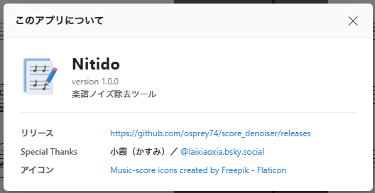

最上段右端の **「ℹ️ このアプリについて」** ボタンから、アプリ名・バージョン・リリースページ・謝辞・アイコンクレジットを確認できます。

- **リリースページ**: GitHub Releases へのリンク（クリックで OS のブラウザで開く）
- **Special Thanks**: フィードバック提供者のクレジット
- **アイコン**: Flaticon の利用許諾表示

---

## トラブルシューティング

### Q. プレビューが「サイドカー起動中…」のまま動かない

サイドカープロセス（Python サーバ）の起動に失敗している可能性があります。

- インストーラで完全インストールできているか確認
- セキュリティソフトがサイドカーをブロックしていないか確認
- 再起動でも改善しない場合は [Issues](https://github.com/osprey74/score_denoiser/issues) にエラー報告ください

### Q. 一括処理中にアプリが固まる

大きな画像 + 大きなカーネル（k=21 以上）の組み合わせは数秒〜十数秒かかる場合があります。進捗バーが動いていれば正常動作中です。

### Q. 日本語ファイル名が含まれていても処理できる？

はい、Nitido は日本語パス対応です（`np.fromfile + cv2.imdecode` で実装）。

### Q. アンインストールしたい

Windows: 「設定 → アプリ → インストールされているアプリ」から **Nitido** を選択して **アンインストール**。設定ファイル `~/.nitido/` は手動で削除してください。

---

## サポート

- バグ報告・機能要望: [GitHub Issues](https://github.com/osprey74/score_denoiser/issues)
- ソースコード: [GitHub Repository](https://github.com/osprey74/score_denoiser)

ライセンス: [MIT License](https://github.com/osprey74/score_denoiser/blob/main/LICENSE)
